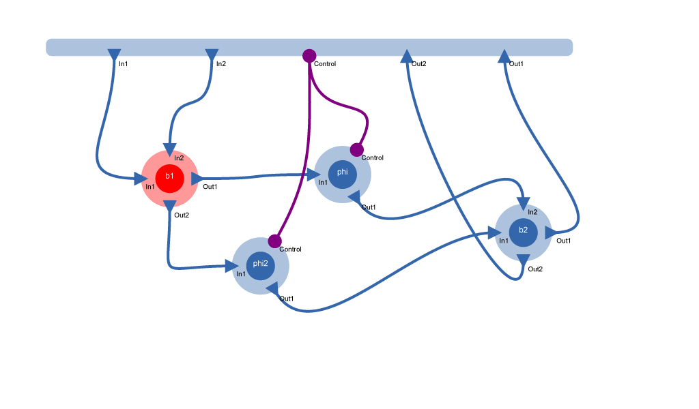

# Visually editing circuits with `cirq`

`Cirq` is a package for creating and editing circuits of arbitrary domain.
The very simple data structure allows for interfacing with further modeling and
simulation backends.

Circuits, i.e., abstract networks of interconnected components with ports,
have found application in various scientific and engineering domains,
ranging from applications close to the physical implementation,
such as electrical circuits, photonic circuits for optical information
processing,
superconducting circuits for quantum information applications
to more abstract circuit representations of dynamical systems,
modeling biological processes or even software algorithms.

Their great applicability has already led to the development of many domain-
specific modeling and simulation
toolkits as well as some very general domain-independent toolkits such as
[Modelica](https://www.modelica.org/),
but to date, there exist very few open source graphical general circuit editing
environments that can be tightly
integrated with custom, domain-specific implementation simulation or
analysis backends as well as [IPython](http://ipython.org).

An in-browser visual circuit editor leads to a rich integrated simulation and
analysis workflow
in which an engineer or researcher can receive very fast feedback when making
changes to his model.
As a consequence, it is much easier to build intuition for the particular kinds
of circuit models
and find novel and creative solutions to an engineering task.

## Example notebooks

Check out (download to see actual circuits)

- [Demo.ipynb](http://nbviewer.ipython.org/github/ntezak/cirq/blob/master/Demo.ipynb) to see how to use cirq
- [Ahkab.ipynb](http://nbviewer.ipython.org/github/ntezak/cirq/blob/master/Ahkab.ipynb) to see how to interface cirq with [Ahkab](https://github.com/ahkab/ahkab)
- [QNET.ipynb](http://nbviewer.ipython.org/github/ntezak/cirq/blob/master/QNET.ipynb) to see how to interface cirq with [QNET](http://mabuchilab.github.io/QNET)

This file is actually based on the first one of these.

    import cirq; reload(cirq); cirq.init_js() # for debugging
    from cirq import *

    <IPython.core.display.Javascript at 0x10ab6a2d0>

## Specifying the domain

Let's assume an example from my field, the connections are given by directed
propagating light fields.
Directed connections are called `causal`. Moreover, each input can only be
connected to a single output
due to reasons of unitarity of the underlying physics. All energy/information
must be accounted for.
This is indicated by the `one2one` keyword, which only applies to domains with
`causal=True`.

To provide an additional example, we also define an electrical domain, which is
undirected/acausal and we will draw its ports and connections in purple.

    fm = Domain(name="fieldmode", causal=True, one2one=True)
    el = Domain(name="electrical", causal=False, _color="purple")
    fm, el

    (Domain(name=fieldmode, causal=True, one2one=True),
     Domain(name=electrical, causal=False, one2one=False))

## Ports
We now specify some port instances that will be re-used by multiple component
types by cloning them, because each port can only belong to a single component.

    Inputs = [Port(name="In{}".format(k+1), domain=fm, direction="in") for k in range(5)]
    Outputs = [Port(name="Out{}".format(k+1), domain=fm, direction="out") for k in range(5)]
    el_port = Port(name="Control", domain=el, direction="inout")
    Inputs, Outputs, el_port

    ([In1, In2, In3, In4, In5], [Out1, Out2, Out3, Out4, Out5], Control)

## Component models

We now define two different component models. A Beamsplitter,i.e., a semi-
transparent mirror which interferometrically mixes two input beams, and an
optical phase shifter, that can be controlled electronically.

    BS = ComponentType(name="Beamsplitter", ports=clone_ports(Inputs[:2]+Outputs[:2]))
    Phase = ComponentType(name="Phase", ports=clone_ports(Inputs[:1]+[el_port]+Outputs[:1]))
    BS, Phase

    (ComponentType(name=Beamsplitter, ports=[Beamsplitter.p.In1, Beamsplitter.p.In2, Beamsplitter.p.Out1, Beamsplitter.p.Out2], params=[]),
     ComponentType(name=Phase, ports=[Phase.p.In1, Phase.p.Control, Phase.p.Out1], params=[]))

## Component instances and our circuit, a Mach-Zehnder interferometer

    b1, b2 = map(BS.make_instance, ["b1", "b2"])
    phi = Phase.make_instance("phi")
    
    mz = Circuit(name="MachZehnder",
                   ports=clone_ports(Inputs[:2]+[el_port]+Outputs[:2]),
                   component_instances=[b1,b2,phi])
    
    mz.connections = [Connection(source=s, target=t) 
                            for (s,t) in [
                                (mz.p.In1, b1.p.In1), 
                                (mz.p.In2, b1.p.In2), 
                                (b1.p.Out1, phi.p.In1),
                                (b1.p.Out2, b2.p.In1),
                                (phi.p.Out1, b2.p.In2),
                                (b2.p.Out1, mz.p.Out1),
                                (b2.p.Out2, mz.p.Out2),
                                (mz.p.Control, phi.p.Control)]]
    mz

<a href='https://rawgithub.com/ntezak/cirq/mz.svg' target='_blank'>mz.svg</a> 

## Change the circuit via an extended UI

    cb = CircuitBuilder([fm, el], [BS, Phase], mz)
    cb

## Export a figure of your circuit

    cb.circuit.save_svg("test")

## Re-Build circuit from scratch

    cb = CircuitBuilder([fm, el], [BS, Phase], Circuit(name="Mach-Zehnder-from-scratch"))
    cb

    
